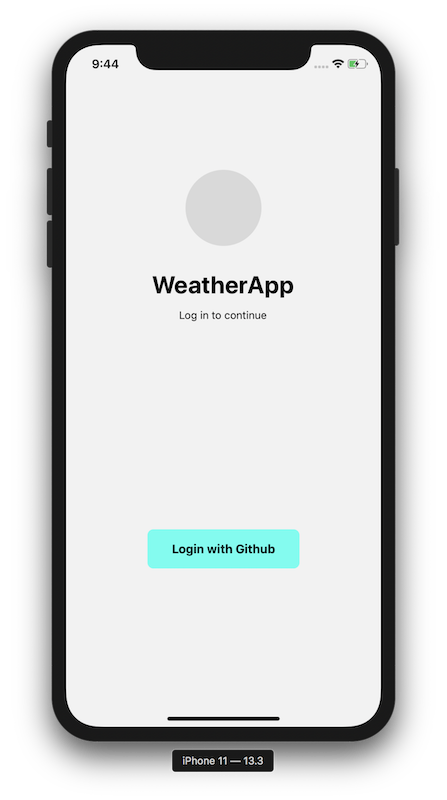

# weatherapp

## running locally

```bash
# install packages
yarn

# install pods
cd ios
pod install

# run app on ios
cd path/to/project
yarn ios
```

## file structure

```
ios/                # Native iOS files
android/            # Native Android project files.
src/
  services/         # External service definitions
  components/       # React Components
  slices/           # redux slices
  Environment.ts    # to manage external dependencies
  init.ts           # The initialize function.
  Navigator.tsx     # create navigator function
  store.ts          # redux store
index.js            # Shared single entry point for both apps. Calls the init function above.
```

### additional information

- followed [SB Standards](https://github.com/smashingboxes/standards)
- followed [golive-react-native](https://github.com/smashingboxes/golive-react-native) as boilerplate
- tracked development time: 9h 48min
- mainly developed in ios
